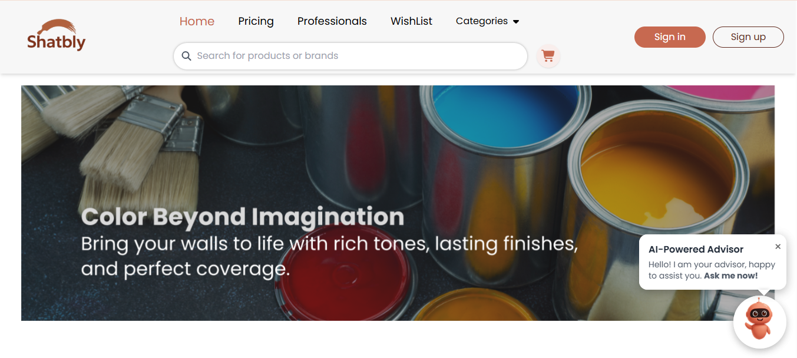
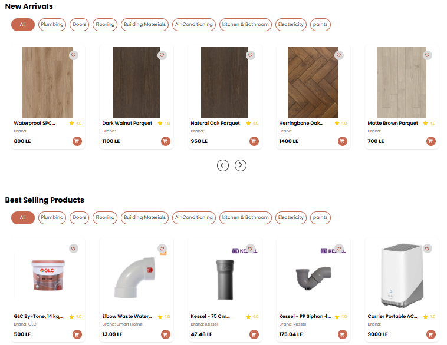
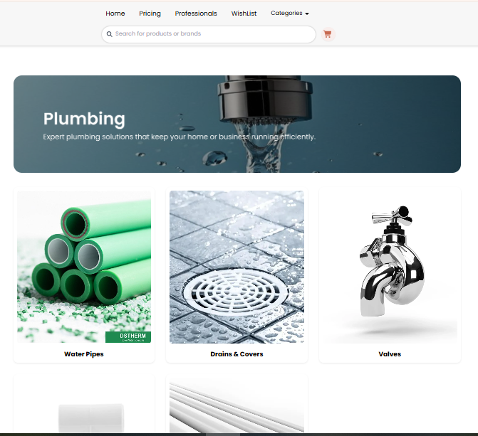
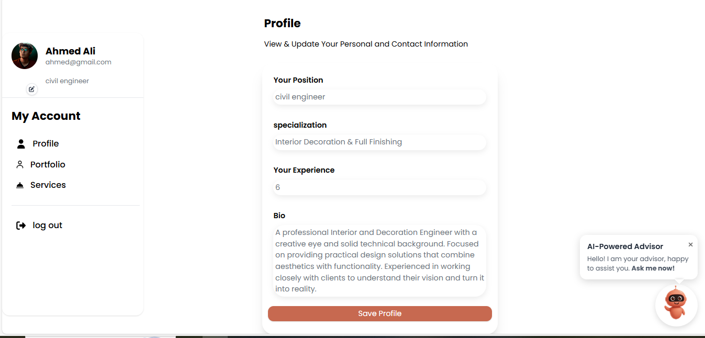

# Shatably — E-commerce (ITI Graduation Project)


This project was developed as a **team effort** as part of the **ITI graduation program**.  
Shatably is a responsive e-commerce frontend built with **Nuxt 4 / Vue 3**.  
It demonstrates a complete shopping flow including product listing, product details, cart functionality, authentication, role-based dashboards, ... and a basic **AI assistant** integrated into the UI to support user navigation and product discovery.


---

## Team
- **Sarah Elaraby** — Team Lead & Frontend Developer  
- **Fatma Mostafa** — Category-Subcategory-Products-Product details & supplier flow
- **Nouran Galil** — components - engineers galerry - engineer portfolio page & user flow
- **Salma Mohamed** — components - chechout page - cart page - search bar .
- **Marina Adel** — Ai Assistant and components.

---

## Role & Contributions (Sarah Elaraby)
- Led the frontend development and supervised the overall project implementation.
- Designed and implemented the **UI architecture** and ensured full **responsive behavior** across all pages.
- Built the **authentication flow** including **Register & Login** using Firebase Authentication.
- Implemented the **Home page** and **Pricing / Feature page**, including the full **cost calculation logic**.
- Developed the **Engineer registration flow** and the **Engineer dashboard**, handling navigation, state, and data display.
- Created and maintained a reusable **component library**, including the main **Navbar**.
- Implemented routing, page layouts, and integrated Firebase for authentication and data management.
- Ensured clean, maintainable, and scalable frontend code following best practices.

---

## Live Demo
🔗 https://shatably-ecommerce-vcqp.vercel.app/

## Screenshots






---

## Tech Stack
- **Framework:** Nuxt 4 + Vue 3  
- **Styling:** Tailwind CSS   
- **Auth / Backend:** Firebase (Authentication & Firestore / Realtime DB)  
- **UI & UX:** Swiper, Lottie, FontAwesome, Iconify  
- **Build Tools:** npm / pnpm / yarn  

---

## Key Features
- Fully responsive product listing and product detail pages
- Cart UX with add/remove items (client-side state)
- User authentication with protected routes (login / register)
- Pricing and cost calculation logic
- Engineer registration flow with dedicated dashboard
- Reusable Vue components and composables for clean code organization

---

## Quick Install & Run

### Prerequisites
- Node.js (v16+ recommended)
- npm, pnpm, or yarn

### Steps

**1. Clone the repository:**
```bash
git clone https://github.com/sarahelaraby2009/Shatably-ecommerce.git
cd Shatably-ecommerce
```

**2. Install dependencies:**
```bash
npm install
# or
pnpm install
# or
yarn install
```

**3. Setup Environment Variables:**
```bash
cp .env.example .env
```
Then add your Firebase configuration to the `.env` file.

**4. Run in Development:**
```bash
npm run dev
```
Visit `http://localhost:3000`

**5. Build for Production:**
```bash
npm run build
npm run preview
```

---

## Repository Structure
```
Shatably-ecommerce/
├── nuxt.config.ts          # Nuxt configuration
├── pages/                  # Route-based pages
├── components/             # Reusable Vue components
├── composables/            # Composable functions (logic hooks)
├── layouts/                # Layout components
├── plugins/                # Nuxt plugins (if any)
├── public/                 # Static assets
├── assets/                 # Images and styles
└── .env.example            # Example environment variables
```

---

## License
This project is licensed under the [MIT License](LICENSE).


